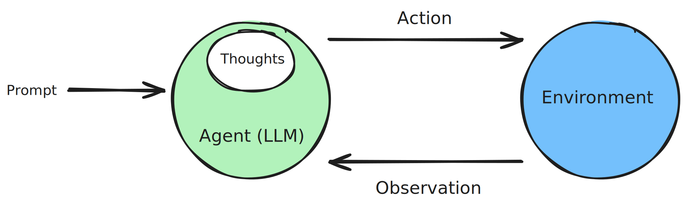

# ReAct: Reasoning and Acting

ReAct is a prompt engineering pattern that synergizes reasoning and acting in language models by interleaving verbal reasoning traces with task-specific actions. The model generates both \"thoughts\" (internal reasoning) for planning, tracking progress, and handling exceptions, and \"actions\" for gathering information or interacting with environments. This creates a powerful feedback loop where reasoning guides what actions to take next, while observations from actions inform better reasoning. Unlike methods that perform only reasoning or only action generation, ReAct combines the strengths of both—enabling the model to induce plans, handle exceptions, and maintain working memory through reasoning while also interfacing with external knowledge and environments through actions.

## Examples

- **Knowledge retrieval**: "Let me search [topic]" → retrieves information → "Based on this result, I need to search [related topic]" → builds comprehensive answer
- **Fact verification**: "The claim states X happened in 2010" → searches database → "According to this source, X actually happened in 2008, so the claim is false"
- **Interactive environments**: "I need to find object X which is likely in location Y" → explores location → "Now I need to use X to accomplish Z" → completes task
- **Web navigation**: "This product listing doesn't mention the size requirement" → clicks details tab → "Now I can see it meets the specifications"
- **Exception handling**: "The expected information isn't here" → reformulates search → "This is a better match for what I need"

## Best for

- Tasks requiring up-to-date external information beyond the model's training data
- Multi-step problem solving that benefits from systematic planning
- Interactive environments where exploration and goal tracking are needed
- Scenarios where showing reasoning enhances trustworthiness and interpretability
- Tasks requiring flexible response to unexpected situations or failures
- Cases where humans may need to intervene by editing the model's reasoning